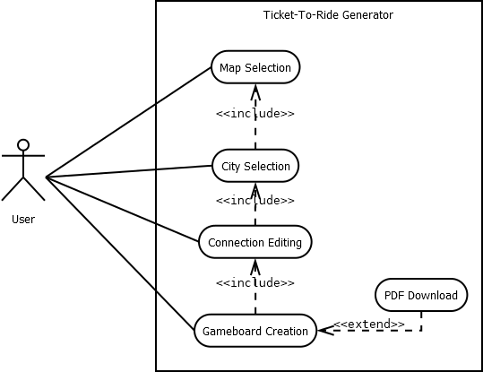

<!-- Improved compatibility of back to top link: See: https://github.com/othneildrew/Best-README-Template/pull/73 -->
<a name="readme-top"></a>
<!--
*** Thanks for checking out the Best-README-Template. If you have a suggestion
*** that would make this better, please fork the repo and create a pull request
*** or simply open an issue with the tag "enhancement".
*** Don't forget to give the project a star!
*** Thanks again! Now go create something AMAZING! :D
-->


<!-- PROJECT SHIELDS -->
<!--
*** I'm using markdown "reference style" links for readability.
*** Reference links are enclosed in brackets [ ] instead of parentheses ( ).
*** See the bottom of this document for the declaration of the reference variables
*** for contributors-url, forks-url, etc. This is an optional, concise syntax you may use.
*** https://www.markdownguide.org/basic-syntax/#reference-style-links
-->
[![Contributors][contributors-shield]][contributors-url]
[![Forks][forks-shield]][forks-url]
[![Stargazers][stars-shield]][stars-url]
[![Issues][issues-shield]][issues-url]
[![MIT License][license-shield]][license-url]


<!-- PROJECT LOGO -->
<br />
<div align="center">
  <a href="https://www.tuwien.at/">
    
  </a>

<h3 align="center">Ticket-To-Ride-Generator</h3>

  <p align="center">
    11730471 <br />
    033 533 Medizinische Informatik
    <br />
    <a href="https://github.com/binapple/Ticket-To-Ride-Generator/issues">Report Bug</a>
    ·
    <a href="https://github.com/binapple/Ticket-To-Ride-Generator/issues">Request Feature</a>
  </p>
</div>


<!-- TABLE OF CONTENTS -->

<details>
  <summary>Table of Contents</summary>

  <!-- TOC -->
  * [Getting Started](#getting-started)
    * [Backend](#backend)
      * [Prerequisites](#prerequisites)
      * [Running the application locally](#running-the-application-locally)
    * [Frontend](#frontend)
      * [Development server](#development-server)
      * [Code scaffolding](#code-scaffolding)
      * [Build](#build)
      * [Further help](#further-help)
  * [About The Project](#about-the-project)
    * [Task-Assignment](#task-assignment)
    * [Use-Case Diagram](#use-case-diagram)
    * [Class Diagram](#class-diagram)
    * [Worktime-Tracking (in German)](#worktime-tracking-in-german)
  * [Implementation](#implementation-)
    * [Built With](#built-with)
    * [Known Bugs](#known-bugs)
    * [Unique Implementation-Details](#unique-implementation-details)
    * [Potential enhancements](#potential-enhancements)
  * [License](#license)
<!-- TOC -->

</details>

<!-- GETTING STARTED -->
## Getting Started

This application is split into a backend and a frontend part. To use the application it is necessary to start
the backend and the frontend each on their own. After cloning the repository from GitHub continue with the following steps.

### Backend

#### Prerequisites

For building and running the application you need:

- [OpenJDK 17 or higher](https://jdk.java.net/archive/)
- [Maven 3.9.3](https://maven.apache.org)

#### Running the application locally

For creating high DPI gameboards it is necessary to give the java virtual machine a bigger max heap size of about 8 Gigabyte (`-Xmx8g`).
When running the application from you IDE check the settings for the java virtual machine.

The backend expects **[Maperitive](http://maperitive.net/)** to be in the following path:

#### Windows

```
C:/Maperitive-latest/Maperitive
```

#### Linux

```
/Maperitive-latest/Maperitive
```

This can be changed to a custom folder in the [application.properties](./backend/src/main/resources/application.properties) file

There are several ways to run a Spring Boot application on your local machine. One way is to execute the `main` method in the `de.codecentric.springbootsample.Application` class from your IDE.

Alternatively you can use the [Spring Boot Maven plugin](https://docs.spring.io/spring-boot/docs/current/reference/html/build-tool-plugins-maven-plugin.html) like so:

```shell
mvn spring-boot:run -Dspring-boot.run.jvmArguments="-Xmx10g"
```

### Frontend

This project was generated with [Angular CLI](https://github.com/angular/angular-cli) version 15.2.8.

#### Development server

Run `ng serve` for a dev server. Navigate to `http://localhost:4200/`. The application will automatically reload if you change any of the source files.

#### Code scaffolding

Run `ng generate component component-name` to generate a new component. You can also use `ng generate directive|pipe|service|class|guard|interface|enum|module`.

#### Build

Run `ng build` to build the project. The build artifacts will be stored in the `dist/` directory.

#### Further help

To get more help on the Angular CLI use `ng help` or go check out the [Angular CLI Overview and Command Reference](https://angular.io/cli) page.


<p align="right">(<a href="#readme-top">back to top</a>)</p>

<!-- ABOUT THE PROJECT -->
## About The Project

It is important to note that this project is a simulation and uses a design inspired by the mechanics and concept of the Ticket to Ride board game.
The rights to the original Ticket to Ride board game belong to their respective owners, and this project does not claim ownership or authorization to utilize any proprietary elements of the original game.

As part of a bachelor thesis this project is implemented as a prototype.

### Task-Assignment

This project is based on the game Ticket to Ride (European edition).
The goal is to provide a gameboard based on the selection of a part of **[Open Street Map][Open-url]** (OSM). This includes:
- an interactive selection of the map itself
- the generation of a typical grid between the biggest cities and towns of the selected map 
  - including distribution of colors, joker and tunnel fields
- an editor to finalize the railway grid with drag-and-drop setting
- generation of ticket cards with long and short "lines"
- a generation of a printable PDF up to DIN-A0-Format of the finished gameboard, and a printable PDF of the ticket cards 

<p align="right">(<a href="#readme-top">back to top</a>)</p>

### Use-Case Diagram



### Class Diagram


### Worktime-Tracking (in German)

**[Timetracking](Zeitliste.md)**

## Implementation 

### Built With

* [![OpenJDK][Java.com]][Java-url]
* [![SpringBoot][Spring.com]][Spring-url]
* [![Maven][Maven.com]][Maven-url]
* [![Open Street Map][Open.com]][Open-url]
* [![Angular][Angular.io]][Angular-url]
* [![Leaflet][Leaflet.com]][Leaflet-url]
* [![Bootstrap][Bootstrap.com]][Bootstrap-url]


<p align="right">(<a href="#readme-top">back to top</a>)</p>

### Known Bugs

Cities and therefore MapPoints are stored with their geographical location.
Those are also used in the calculations for fitting in connections between them.
This results in different spaces between finished train-connections.
For correctly placing the train-squares on the rendered OSM map a so called "Mercator-Projection" is used.
This mercator projection could be used earlier when creating MapPoints from Cities for example, but
would lead to more problems when visually showing with leaflet in the frontend (as leaflet uses geographical not projected values).

As this is a prototype, input validation and error handling are not really prioritized,
therefore wrong data passed to the backend can result in unintended behaviour.

### Unique Implementation Details

During the first review of the assignment, graphs seemed like a helpful tool for implementation. 
Graph theory is used to create a complete graph out of the chosen cities. 
The resulting connections were then reduced to match the Ticket-To-Ride lengths and afterward filtered to not have cross-over sections.
For creating the tickets and their corresponding values, which is the shortest path between them, Dijkstra-Algorithm has been used.

The data, mainly the cities, their location and population that are used in this program comes from **[Overpass Turbo](https://overpass-turbo.eu/)** API calls. 
This allows smooth displaying of the geographical data used or generated through the program in **[Leaflet][Leaflet-url]**.

For rendering the OSM Map **[Maperitive](http://maperitive.net/)** an external program is used.
It can be started with scripts that enabled something similar to an interface between java and the program.
Afterward **[Apache Batik](https://xmlgraphics.apache.org/batik/)** is used for creating a complete SVG File out of smaller SVG-Files,
each representing one Ticket-To-Ride field, plus the rendered image as background. 
Then again Apache Batik is used to transcode the SVG-File into a complete PDF-File for potential printing. 
The same approach is used for the Ticket-Cards, but they are not individually stored, rather than fit together in one file side-by-side.

### Potential enhancements

As described in the **[Known Bugs](#known-bugs)** section the "Mercator-Projection" is used for changing geographical location data to a two-dimensional map.
For a more accurate way of placing the train fields this could be done earlier, when creating MapPoints,
so that all the calculations are also done in the correct coordinate system. 
For showing the results in the frontend on leaflet geographical locations are necessary, therefore a "reverse Mercator-Projection".
Another approach would be to store geographical and "projected" data to each MapPoint or City.

As Maperitive currently only supports one instance per executable file, the creation of the gameboard process is currently not simultaneously runnable.
This could be solved with different APIs for OSM map rendering, but research on the net found that this may be behind a paywall,
whereas Maperitive allows big render-sizes and is available as open source.


<!-- USAGE EXAMPLES -->

[//]: # (## Usage)

[//]: # ()
[//]: # (Use this space to show useful examples of how a project can be used. Additional screenshots, code examples and demos work well in this space. You may also link to more resources.)

[//]: # ()
[//]: # (_For more examples, please refer to the [Documentation]&#40;https://example.com&#41;_)

[//]: # ()
[//]: # (<p align="right">&#40;<a href="#readme-top">back to top</a>&#41;</p>)


<!-- ROADMAP -->

[//]: # (## Roadmap)

[//]: # ()
[//]: # (- [ ] Feature 1)

[//]: # (- [ ] Feature 2)

[//]: # (- [ ] Feature 3)

[//]: # (    - [ ] Nested Feature)

[//]: # ()
[//]: # (See the [open issues]&#40;https://github.com/binapple/Ticket-To-Ride-Generator/issues&#41; for a full list of proposed features &#40;and known issues&#41;.)

[//]: # ()
[//]: # (<p align="right">&#40;<a href="#readme-top">back to top</a>&#41;</p>)


<!-- CONTRIBUTING -->

[//]: # (## Contributing)

[//]: # ()
[//]: # (Contributions are what make the open source community such an amazing place to learn, inspire, and create. Any contributions you make are **greatly appreciated**.)

[//]: # ()
[//]: # (If you have a suggestion that would make this better, please fork the repo and create a pull request. You can also simply open an issue with the tag "enhancement".)

[//]: # (Don't forget to give the project a star! Thanks again!)

[//]: # ()
[//]: # (1. Fork the Project)

[//]: # (2. Create your Feature Branch &#40;`git checkout -b feature/AmazingFeature`&#41;)

[//]: # (3. Commit your Changes &#40;`git commit -m 'Add some AmazingFeature'`&#41;)

[//]: # (4. Push to the Branch &#40;`git push origin feature/AmazingFeature`&#41;)

[//]: # (5. Open a Pull Request)

[//]: # ()
[//]: # (<p align="right">&#40;<a href="#readme-top">back to top</a>&#41;</p>)


<!-- LICENSE -->
## License

Distributed under the MIT License. See `LICENSE.txt` for more information.

<p align="right">(<a href="#readme-top">back to top</a>)</p>


<!-- CONTACT -->

[//]: # (## Contact)

[//]: # ()
[//]: # (Your Name - [@twitter_handle]&#40;https://twitter.com/twitter_handle&#41; - e11730471@student.tuwien.ac.at.com)

[//]: # ()
[//]: # (Project Link: [https://github.com/binapple/Ticket-To-Ride-Generator]&#40;https://github.com/binapple/Ticket-To-Ride-Generator&#41;)

[//]: # ()
[//]: # (<p align="right">&#40;<a href="#readme-top">back to top</a>&#41;</p>)


<!-- ACKNOWLEDGMENTS -->

[//]: # (## Acknowledgments)

[//]: # ()
[//]: # (* []&#40;&#41;)

[//]: # (* []&#40;&#41;)

[//]: # (* []&#40;&#41;)

[//]: # ()
[//]: # (<p align="right">&#40;<a href="#readme-top">back to top</a>&#41;</p>)


<!-- MARKDOWN LINKS & IMAGES -->
<!-- https://www.markdownguide.org/basic-syntax/#reference-style-links -->
[contributors-shield]:  https://img.shields.io/github/contributors/binapple/Ticket-To-Ride-Generator.svg?style=for-the-badge
[contributors-url]: https://github.com/binapple/Ticket-To-Ride-Generator/graphs/contributors
[forks-shield]: https://img.shields.io/github/forks/binapple/Ticket-To-Ride-Generator.svg?style=for-the-badge
[forks-url]: https://github.com/binapple/Ticket-To-Ride-Generator/network/members
[stars-shield]: https://img.shields.io/github/stars/binapple/Ticket-To-Ride-Generator.svg?style=for-the-badge
[stars-url]: https://github.com/binapple/Ticket-To-Ride-Generator/stargazers
[issues-shield]: https://img.shields.io/github/issues/binapple/Ticket-To-Ride-Generator.svg?style=for-the-badge
[issues-url]: https://github.com/binapple/Ticket-To-Ride-Generator/issues
[license-shield]: https://img.shields.io/github/license/binapple/Ticket-To-Ride-Generator.svg?style=for-the-badge
[license-url]: https://github.com/binapple/Ticket-To-Ride-Generator/blob/main/LICENSE.txt
[linkedin-shield]: https://img.shields.io/badge/-LinkedIn-black.svg?style=for-the-badge&logo=linkedin&colorB=555
[linkedin-url]: https://linkedin.com/in/linkedin_username
[product-screenshot]: images/screenshot.png
[Next.js]: https://img.shields.io/badge/next.js-000000?style=for-the-badge&logo=nextdotjs&logoColor=white
[Next-url]: https://nextjs.org/
[React.js]: https://img.shields.io/badge/React-20232A?style=for-the-badge&logo=react&logoColor=61DAFB
[React-url]: https://reactjs.org/
[Vue.js]: https://img.shields.io/badge/Vue.js-35495E?style=for-the-badge&logo=vuedotjs&logoColor=4FC08D
[Vue-url]: https://vuejs.org/
[Angular.io]: https://img.shields.io/badge/Angular-DD0031?style=for-the-badge&logo=angular&logoColor=white
[Angular-url]: https://angular.io/
[Svelte.dev]: https://img.shields.io/badge/Svelte-4A4A55?style=for-the-badge&logo=svelte&logoColor=FF3E00
[Svelte-url]: https://svelte.dev/
[Laravel.com]: https://img.shields.io/badge/Laravel-FF2D20?style=for-the-badge&logo=laravel&logoColor=white
[Laravel-url]: https://laravel.com
[Bootstrap.com]: https://img.shields.io/badge/Bootstrap-563D7C?style=for-the-badge&logo=bootstrap&logoColor=white
[Bootstrap-url]: https://getbootstrap.com
[JQuery.com]: https://img.shields.io/badge/jQuery-0769AD?style=for-the-badge&logo=jquery&logoColor=white
[JQuery-url]: https://jquery.com 
[Spring.com]: https://img.shields.io/badge/Spring%20Boot-6DB33F?style=for-the-badge&logo=springboot&logoColor=white
[Spring-url]: https://spring.io/projects/spring-boot
[Java.com]: https://img.shields.io/badge/OpenJDK-437291?style=for-the-badge&logo=openjdk&logoColor=white
[Java-url]: https://openjdk.org/
[Leaflet.com]: https://img.shields.io/badge/Leaflet-199900?style=for-the-badge&logo=leaflet&logoColor=white
[Leaflet-url]: https://leafletjs.com/
[Maven.com]: https://img.shields.io/badge/Maven-C71A36?style=for-the-badge&logo=apachemaven&logoColor=white
[Maven-url]: https://maven.apache.org/
[Open.com]: https://img.shields.io/badge/Open%20Street%20Map-%237EBC6F?style=for-the-badge&logo=openstreetmap&logoColor=white
[Open-url]: https://www.openstreetmap.org/
